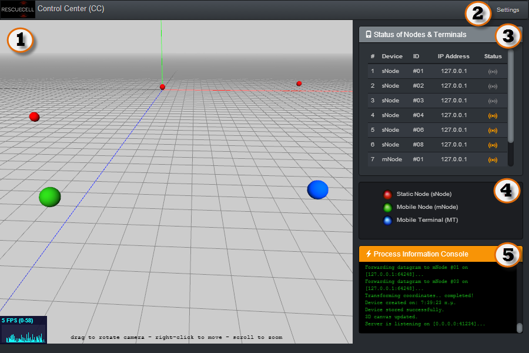

# RescueCell - Control Center

Portable kit written in NodeJs and WebGL for visualizing in 3D the positions of burried victims in ruins and avalances. 

Collects the data received from the various static and mobile nodes (sNodes and mNodes) and displays their positions in an interactive way within a 3D canvas presentation. Utilizes UDP sockets due to connectionless and faster lightweight nature.

### Index

1. 3D grid canvas.
2. Settings button
3. Status of Nodes & Terminals panel
4. 3D canvas map key
5. Process Information Console panel

### Settings

1. Activity timeout setting
2. Listening port setting
3. Positioning Algorithm IP address setting
4. Accuracy Indicators switch
5. Search area highlight switch